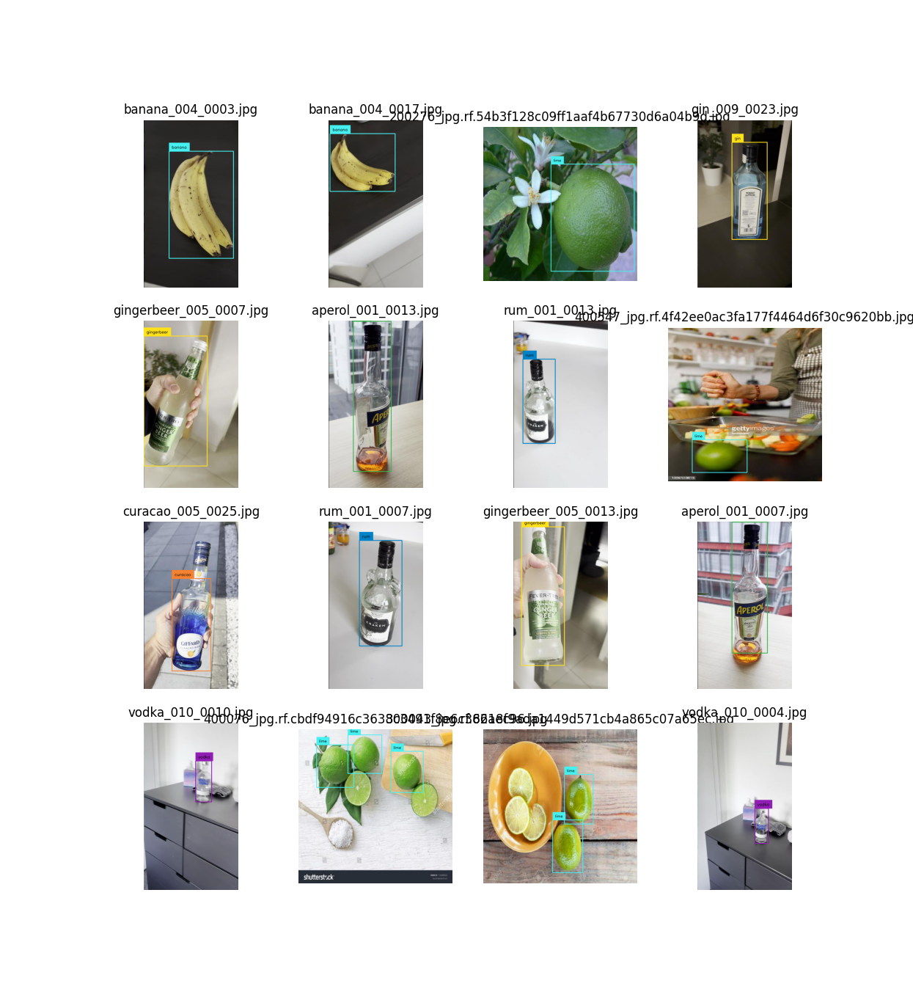

# CaipirinIA Model Training

Scripts for generate a datasets from home-made videos, Then be able to train model for our iOs App

We almost work with 2 formats: CreateML and YOLO(v8)


## CreateML

**CreateML** is a machine learning framework developed by Apple, designed for building and training custom machine learning models on macOS. It allows developers to create models using a simple, drag-and-drop interface within Xcode, making it accessible for users without extensive data science or coding expertise. With CreateML, users can train models for a variety of tasks such as image classification, text analysis, and sound recognition. The framework supports integration with Swift and leverages Apple's Core ML to efficiently deploy models on iOS, macOS, watchOS, and tvOS devices.


## YoloV8


**YOLO** (You Only Look Once) is a real-time object detection system that uses a single neural network to predict bounding boxes and class probabilities directly from full images in one evaluation. Developed initially by Joseph Redmon, YOLO is known for its speed and accuracy, making it suitable for applications requiring real-time processing, such as autonomous driving, surveillance, and robotics. YOLO divides an image into a grid and assigns bounding boxes and class probabilities to detect objects within those regions, achieving fast inference speeds by optimizing the entire process in a single pass through the network.


## How to?

### Python env

Prepare your Python env.

```
python -m venv caipirinienv
source caipirinienv/bin/activate
```

Install dependencies
```
pip install ultralytics
```

### Prepare your videos

All your videos must organise in a folder which respect the following structure:

/rum
    convert.json
    videos with only one bottle of this kind
/gin_brandA
    convert.json
    videos with only one bottle of this kind
/gin_brandB
    convert.json
    videos with only one bottle of this kind
etc...

Each 'convert.json' explain the expected result.

**Example**: 

```
{
    "class_label": {
        "from": [
            "bottle"
        ],
        "to": "absinthe"
    }
}
```
The file described that, for all videos in the current folder, with the model used (yolo), when I detect a 'bottle', I can convert the label of the detected annotation to 'absinthe'.


### Build the Datasets

All our custom scripts have to objective to quickly generate a lot of annotated image from the video.

**videos_to_datasets**

The most importnat script which will :
- parse videos folder
- read convert.json file
- extract frame from video
- use a yolo model to detect object from the COCO class labels
- convert detected annotation to annotation with our class labels (caiprinia_labels.txt)
- generate a dataset with images+labels

```
python videos_to_datasets.py
```

The expected result of this script is a folder with:
- a sub folder 'images' with all the extracted frame from videos where a detection has been done
- a sub folder 'labels' with annotations text files (each file should have a corresponding image with same filename)

**split_dataset**

With the previous script, we generated images and lables in on single folder.
But to train the model, we need to split this in 3 folders : train (70%), valid (25%), test (5%)

```
python split_datasets.py
```

**generate_createml_annotations**

At this step, you have all you need to train a model with YOLO (cf next chapter)

But if you need to use CreateML, use the script 'generate_createml_annotations' to generate annotation files for CreateMl from the YOLO annotation files. 

```
python generate_createml_annotations.py
```
At the end of the script, you must see 1 file per images folder:  **_annotations.createml.json**

**display_dataset.py**

This script is useful to check that everything is correctly annotated.
It generate an image grid:




## Check list before training

You are ready for the next step when you have a dataset folder with:

- train
    - images 
    - labels
- valid
    - images
    - labels
- test
    - images
    - labels
- data.yaml (the dataset description file)

example:
```yaml
names:
- cocacola
- aperol
- gin
- rum
nc: 4
train: /${HOME}/dataset/train
val: /${HOME}/dataset/valid
```


### Train the model with YOLO


```
python yolo_train.py
```
or with pre-trained model
```
yolo detect train data=caipirinia.yaml model=yolov8n.pt epochs=10 imgsz=640 device=0
```
or from scratch
```
yolo detect train data=caipirinia.yaml model=yolov8n.yaml epochs=10 imgsz=640 device=0
```

### convert to coreml 

Yolo provide a convertion script to convert the model to a CreateML model.
**But It do not works!** 
That's why we had to change our strategy, and convert the dataset to createml format and generate the model with CreateML.

```
python export_yolo.py
```
or
```
yolo export model=yolov8_caipirinia.pt format=coreml
```

### Train the model with CreateML

Start XCode
In XCode Menu, Open menu 'Open Developer Tools'
Open 'Create ML'
Create a 'Object Detection' Project
Select your train folder
Select your validation folder
Select a test folder (optionnal)
Start 'Train'


The expected result is a .mlmodel file ready to drag and drop in your iOS app:


```swift
func setupDetector() {
        
        do {
        
            let mlModel = try CaipiriniaDetector().model
            
            let visionModel = try VNCoreMLModel(for: mlModel)
          
            let recognitions = VNCoreMLRequest(model: visionModel, completionHandler: detectionDidComplete)
                       
            self.requests = [recognitions]

        } catch let error {
            print(error)
        }
    }
```


## Autodistill

We latelly discover the concept of Zero-Shot Detection and the tool 'autodistill'

The objective of this project is to quicly annotate and segment images from a model + prompt.

```
pip install autodistill autodistill-grounded-sam autodistill-yolov8
```

cf our experiments in **distill.py** and **zeroshot.py**